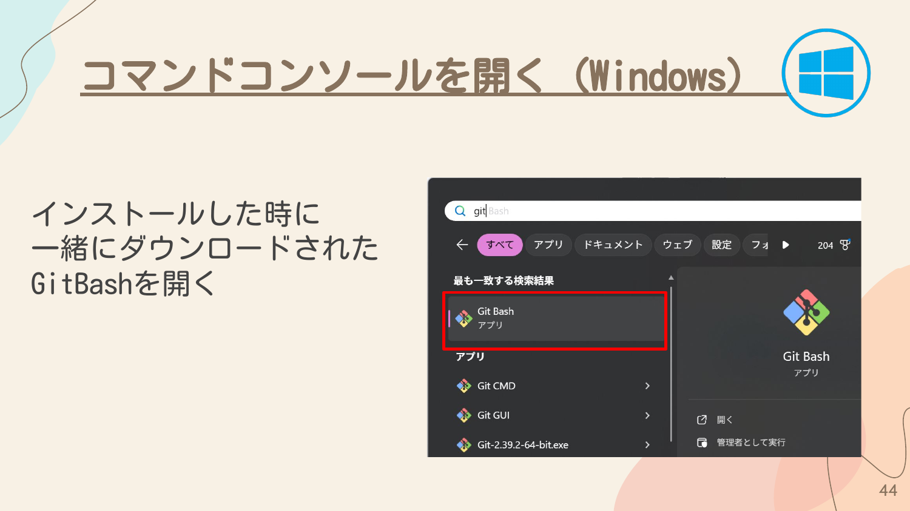
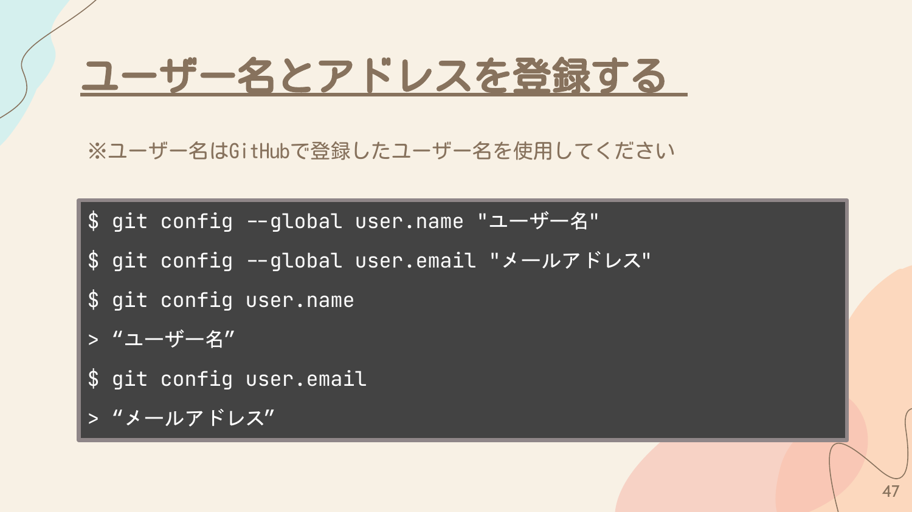
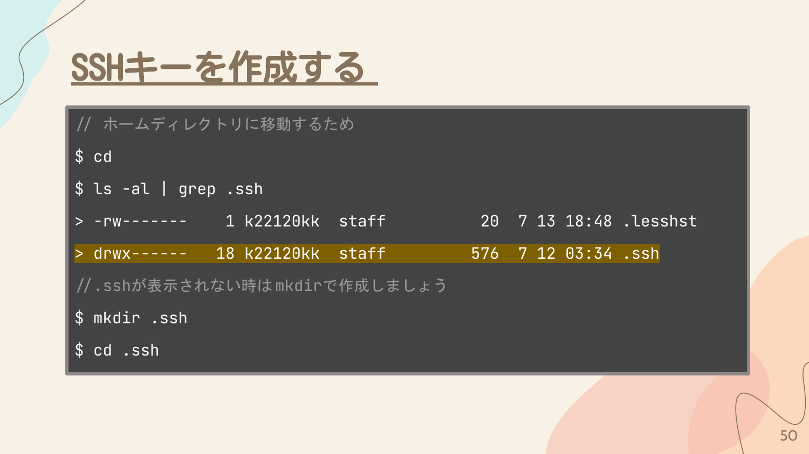
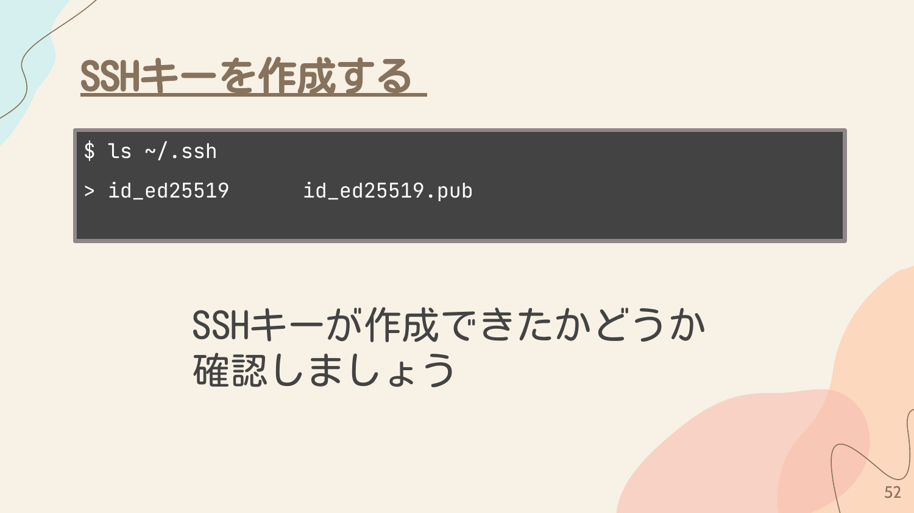
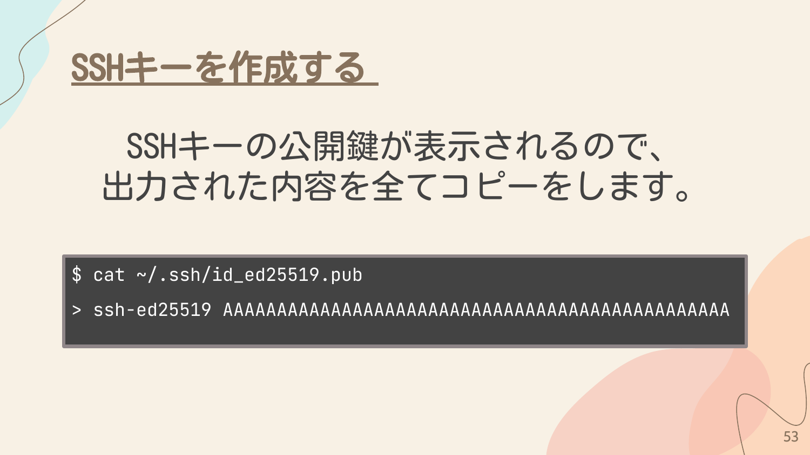
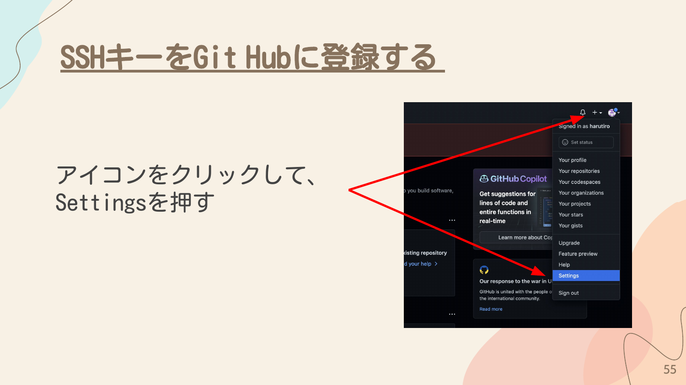
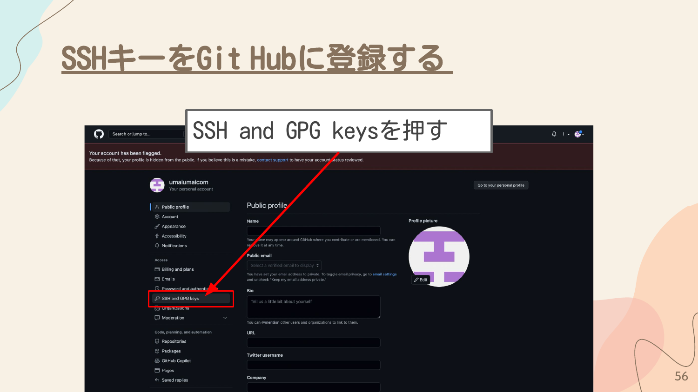
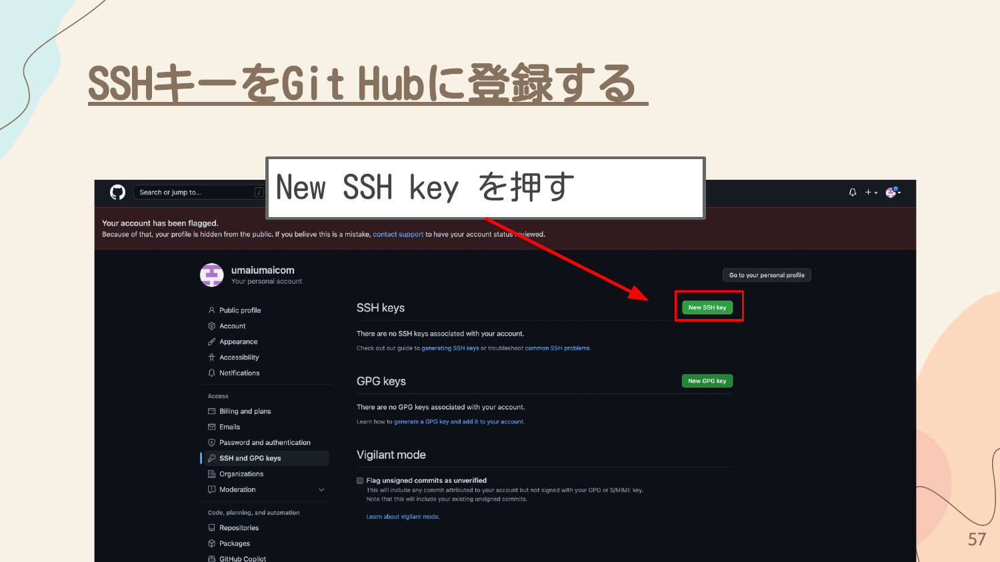
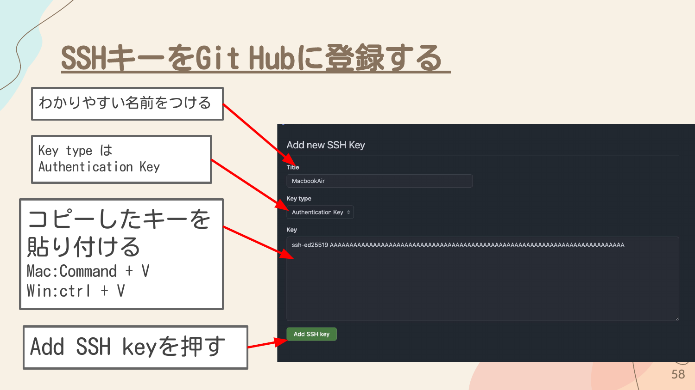
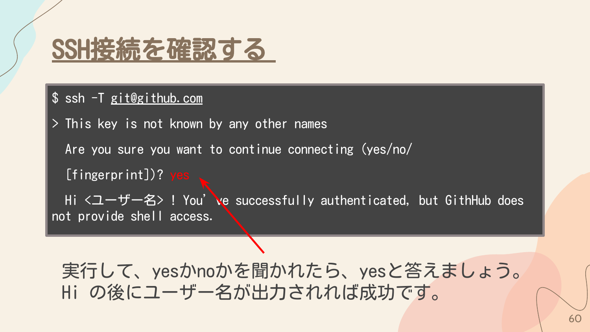

## ターミナルを起動しよう

### Macの場合

1. `Command` + `Space` を押してSpotlightを開く
2. 「ターミナル」と入力
3. `Enter` を押す

### Windowsの場合

Git Bashを起動します。



## ユーザー名とアドレスを登録する

GitHubで登録したユーザー名とメールアドレスを設定します。

```bash
# ユーザー名を設定
git config --global user.name "ユーザー名"

# メールアドレスを設定
git config --global user.email "メールアドレス"
```

設定を確認するには以下のコマンドを実行します。

```bash
# ユーザー名を確認
git config user.name

# メールアドレスを確認
git config user.email
```



## SSHを用いてログインをする理由

2021年8月13日まではユーザー名とパスワードを用いてログインを行っていました。しかし、ユーザー名とパスワードでは、漏れてしまった時に乗っ取られる危険があったため、よりセキュアである、公開鍵認証を用いた方式に変更されました。

### SSHを用いるメリット

- 認証に必要な秘密情報そのものはネットワーク上に送出されない
- 認証に使われる署名は一時的なもので再利用はできない
- 秘密鍵を推測して偽造することは非常に困難
- パスフレーズを設定して鍵そのものをロックすることができる

## SSHキーを作成する

### 1. ホームディレクトリに移動して.sshフォルダを確認

```bash
# ホームディレクトリに移動
cd

# .sshフォルダがあるか確認
ls -al | grep .ssh
```

`.ssh`フォルダが表示されない場合は作成します。



```bash
# .sshフォルダを作成
mkdir .ssh

# .sshフォルダに移動
cd .ssh
```

### 2. SSHキーを生成

```bash
ssh-keygen -t ed25519
```

実行すると以下の質問が表示されます。

1. **ファイル名の指定** - デフォルトのままでOKなので、そのまま `Enter` を押す
2. **パスワードの設定** - 今回はそのまま `Enter` を押す
3. **パスワードの確認** - 今回はそのまま `Enter` を押す

### 3. SSHキーが作成できたか確認

```bash
ls ~/.ssh
```

`id_ed25519` と `id_ed25519.pub` の2つのファイルが表示されれば成功です。



### 4. 公開鍵の内容をコピー

SSHキーの公開鍵が表示されるので、出力された内容を全てコピーします。

```bash
cat ~/.ssh/id_ed25519.pub
```

出力例:
```
ssh-ed25519 AAAAAAAAAAAAAAAAAAAAAAAAAAAAAAAAAAAAAAAAAAAAAAAAAAAAAAAAAAAAAAAAAAAA
```



## SSHキーをGitHubに登録する

1. https://github.com にアクセスする
2. 右上のアイコンをクリックして、**Settings** を押す



3. 左側のメニューから **SSH and GPG keys** を押す



4. **New SSH key** ボタンを押す



5. 以下の情報を入力:
   - **Title**: わかりやすい名前をつける（例: MacBookAir）
   - **Key type**: Authentication Key
   - **Key**: コピーした公開鍵を貼り付ける
6. **Add SSH key** ボタンを押す



登録した名前が表示されれば成功です。

## SSH接続を確認する

以下のコマンドを実行して、GitHubに接続できるか確認します。

```bash
ssh -T git@github.com
```

初回接続時は以下のようなメッセージが表示されます。

```
This key is not known by any other names
Are you want to continue connecting (yes/no/[fingerprint])?
```

`yes` と入力して `Enter` を押します。

```
Hi <ユーザー名>! You've successfully authenticated, but GitHub does not provide shell access.
```

`Hi` の後にユーザー名が出力されれば成功です。


