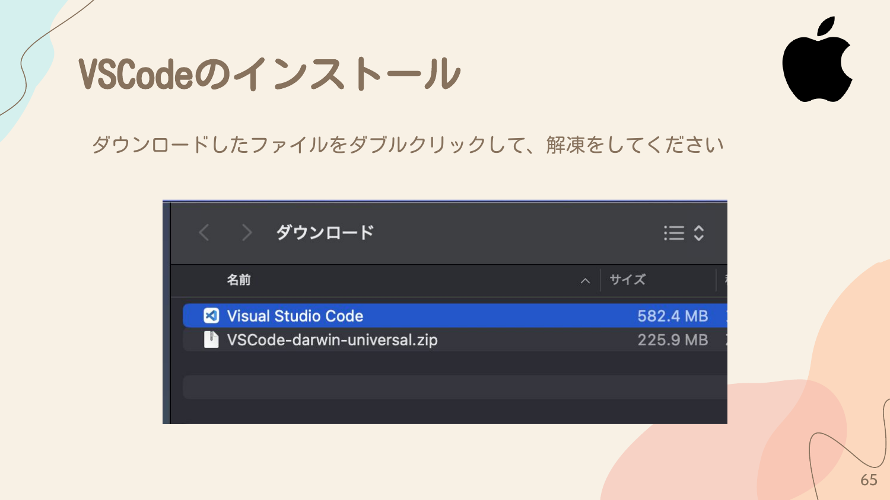
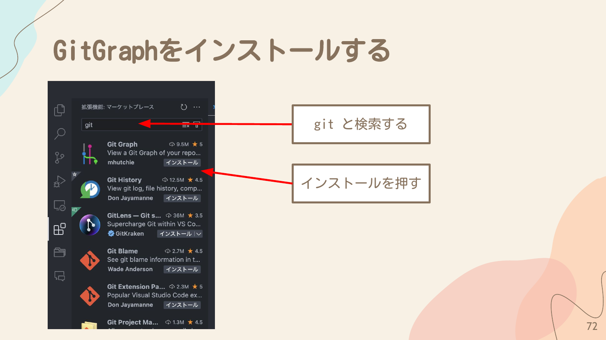

## VSCodeとは?

Microsoftが作成した、無料のファイルエディタです。拡張機能が充実していて、軽量なためみんなに愛されています。今回Gitの管理はVSCode上から行います。

## VSCodeのインストール

### Windowsの場合

以下のリンクを参考にして、インストールを行ってください。

https://qiita.com/mmake/items/2cf2131a0ab5bc431215

### Macの場合

1. 以下のURLにアクセスして、**Download for Mac** を押す

   https://code.visualstudio.com/

2. ダウンロードしたファイルをダブルクリックして、解凍をしてください

3. Visual Studio Codeをアプリケーションフォルダーに移しましょう

4. Launchpadをクリックして、Visual Studio Codeが表示されていれば、クリックして、アプリを開きましょう

## PATHにCodeをインストールする（Macのみ）

シェルで `code .` と入力した時に、VSCodeを起動するための設定です。

1. `Command` + `Shift` + `P` を押してコマンドパレットを表示する
2. `path` と入力して、「シェルコマンド: PATH内に 'code' コマンドをインストールします」を押す
3. ポップアップの通りに進める
4. 「シェルコマンド 'code' が〜」と表示されれば完了

## 拡張機能について

VSCodeの拡張機能は有志で作成されているため、同じような機能でも複数個の拡張機能があります。Git History派の人もいますし、Git Graph派の人もいます。

今回は Git Graph で資料を作成します。他の拡張機能を使いたい方は、いい感じに読み替えていただけると助かります。

## Git Graphをインストールする

1. VSCodeの左側にある拡張機能アイコン（四角が4つのアイコン）を押す

2. 検索欄に `git` と入力する
3. **Git Graph** を見つけて、**インストール** ボタンを押す

4. 「無効にする」という表示がされればインストールが完了です

## Tips: おすすめの拡張機能

### Material Icon Theme
ファイルのアイコンの見た目を変える拡張機能です。

### One Dark Pro
VSCodeのテーマを変える拡張機能です。

### Code Spell Checker
誤字を見つけてくれる拡張機能です。

### Japanese Language Pack for Visual Studio Code
VSCodeを日本語対応にする拡張機能です。

