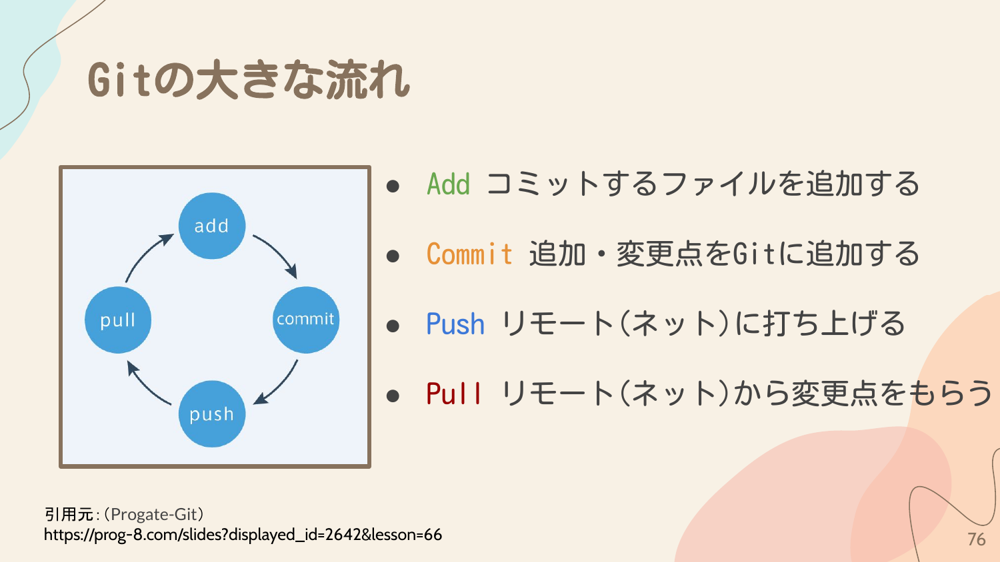
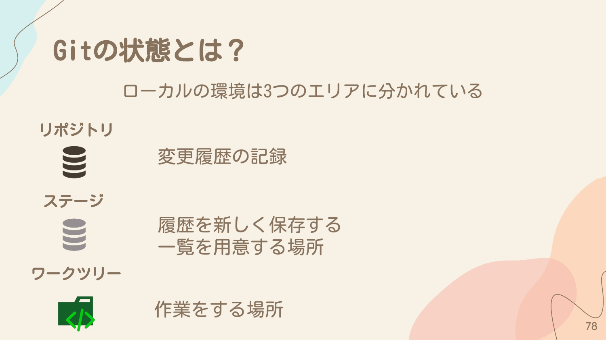
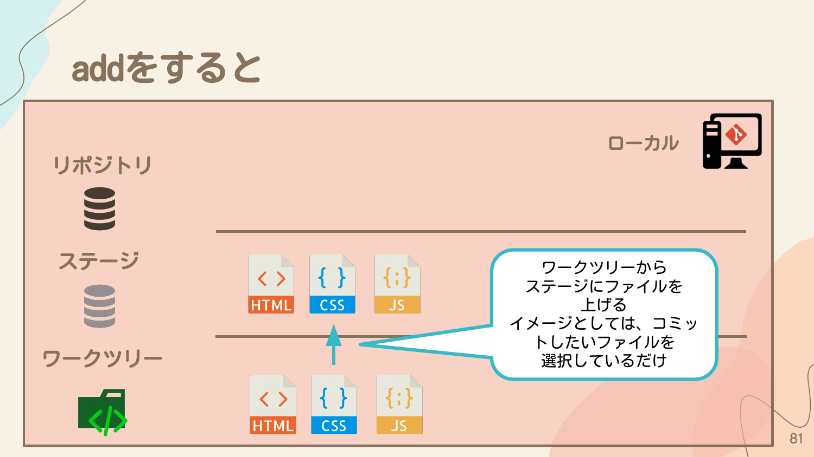
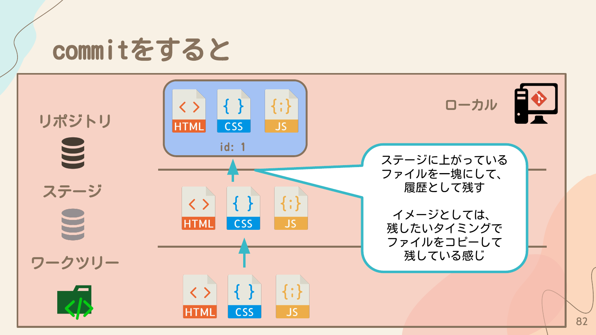
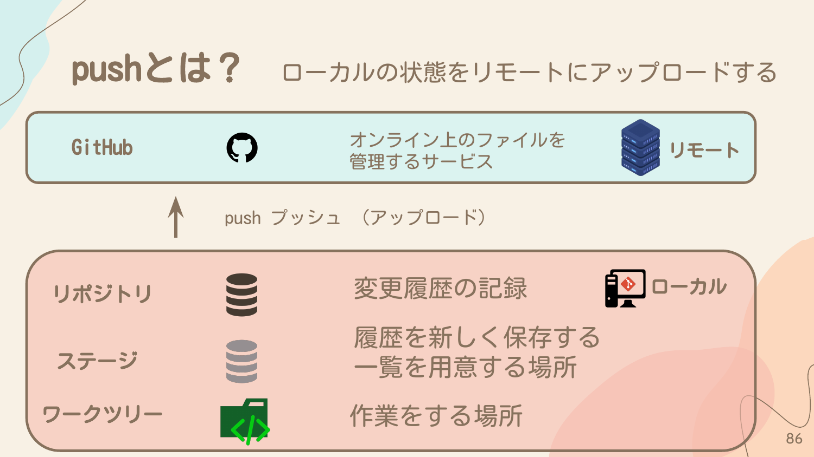
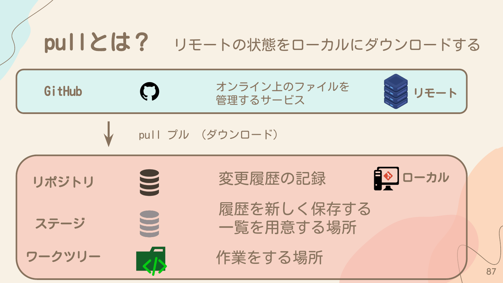
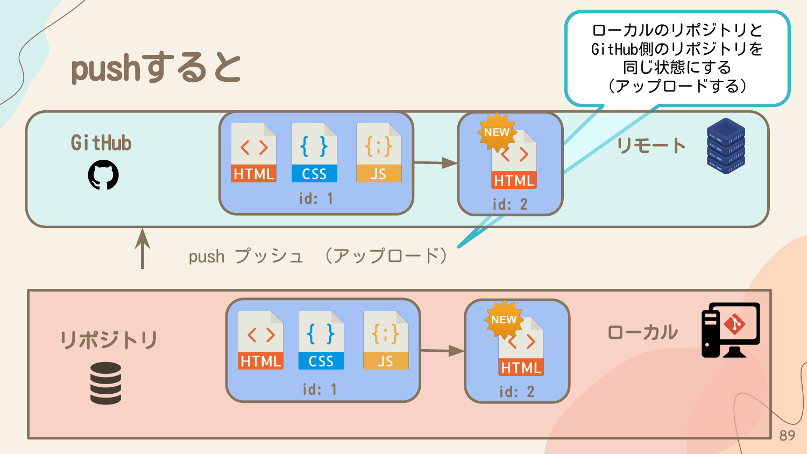

## Gitの大きな流れ

Gitの基本的な操作は以下の4つです。

- **Add** - コミットするファイルを追加する
- **Commit** - 追加・変更点をGitに追加する
- **Push** - リモート（ネット）に打ち上げる
- **Pull** - リモート（ネット）から変更点をもらう



## Gitの状態とは?

ローカルの環境は3つのエリアに分かれています。

### リポジトリ
変更履歴の記録を保存する場所です。

### ステージ
履歴を新しく保存する一覧を用意する場所です。コミットしたいファイルを選択する場所とも言えます。

### ワークツリー
作業をする場所です。実際にファイルを編集する場所です。



## ファイルの編集をしているとき

ワークツリーでファイルを編集します。この時点では、Gitには何も記録されていません。

## addをすると

`git add` コマンドを実行すると、ワークツリーからステージにファイルを上げます。

イメージとしては、コミットしたいファイルを選択しているだけです。

```bash
# 特定のファイルをステージに追加
git add ファイル名

# すべての変更をステージに追加
git add .
```



## commitをすると

`git commit` コマンドを実行すると、ステージに上がっているファイルを一塊にして、履歴として残します。

イメージとしては、残したいタイミングでファイルをコピーして残している感じです。

```bash
git commit -m "コミットメッセージ"
```



## ファイルを少し変更する

コミット後にファイルを変更した場合（例: HTMLファイルにButtonのタグを追加）、その変更はワークツリーにのみ存在します。

## 変更点をaddする

変更したファイルだけをステージに上げます。それ以外のファイルはあげません。

Gitは差分だけを保存するので、変更した部分だけが記録されます。

## 変更点をcommitする

ステージに上がっているファイルの変更内容を、変更履歴に残します。

これで新しいコミット（id: 2）が作成され、履歴として保存されます。

## pushとは?

ローカルの状態をリモートにアップロードすることです。

- **GitHub** - オンライン上のファイルを管理するサービス（リモート）
- **push（プッシュ）** - アップロード

ローカルのリポジトリとGitHub側のリポジトリを同じ状態にする（アップロードする）操作です。

```bash
git push origin main
```



## pullとは?

リモートの状態をローカルにダウンロードすることです。

- **pull（プル）** - ダウンロード

他の人が変更をpushした場合、その変更を自分のローカル環境に取り込むために使用します。

```bash
git pull origin main
```





## まとめ

Gitの基本的な流れは以下の通りです。

1. **ファイルを編集する** - ワークツリーで作業
2. **add** - 変更したファイルをステージに追加
3. **commit** - ステージの内容を履歴として保存
4. **push** - ローカルの履歴をリモートにアップロード
5. **pull** - リモートの変更をローカルにダウンロード

この流れを繰り返すことで、チームでの開発やバージョン管理が可能になります。
