import { Tabs, TabItem } from '@astrojs/starlight/components'
export const CLI_OR_GUI_SYNC_KEY = 'git::cli-or-gui';

## Gitの大きな流れ

Gitでは以下の4つの操作を繰り返して開発を進めます。

- **Add** - コミットするファイルを追加する
- **Commit** - 追加・変更点をGitに追加する
- **Push** - リモート（ネット）に打ち上げる
- **Pull** - リモート（ネット）から変更点をもらう

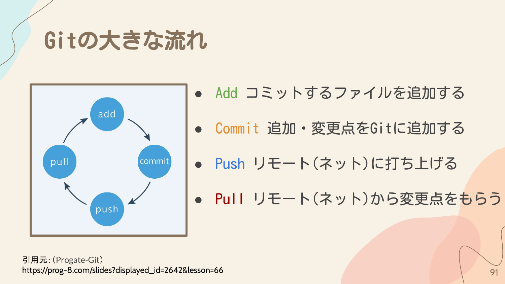

## プロジェクトを作成する

<Tabs syncKey={CLI_OR_GUI_SYNC_KEY}>
  <TabItem label="VSCode">

### 1. フォルダを開く

VS Codeのエクスプローラーから「フォルダーを開く」を押します。

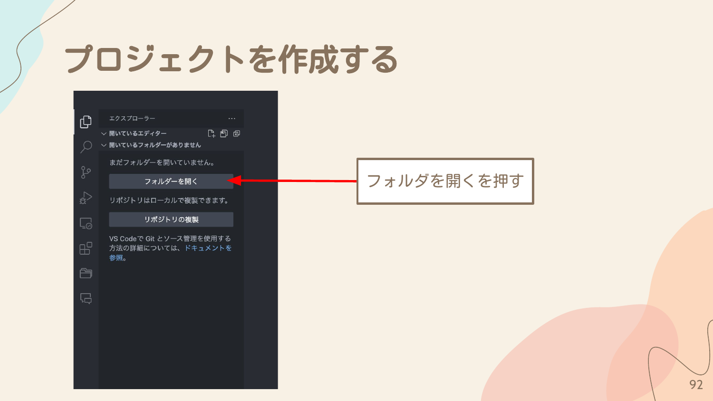

### 2. 新規フォルダを作成

プロジェクトを作成したい場所で「新規フォルダ」を押します。

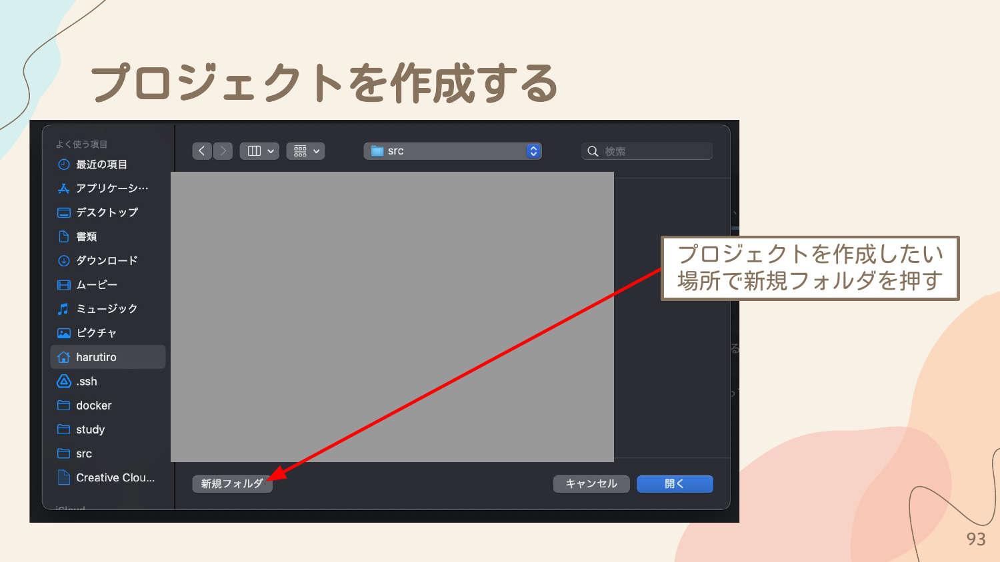

### 3. プロジェクト名を設定

プロジェクト名を適宜設定して「作成」を押します。今回は `GitTest` とします。

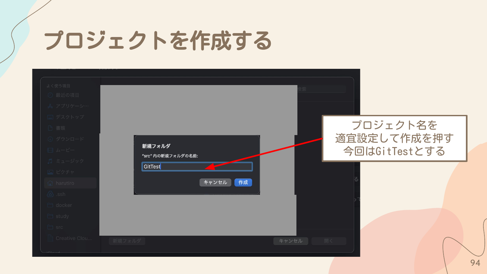

### 4. フォルダを開く

作成したフォルダを選択して「開く」を押します。

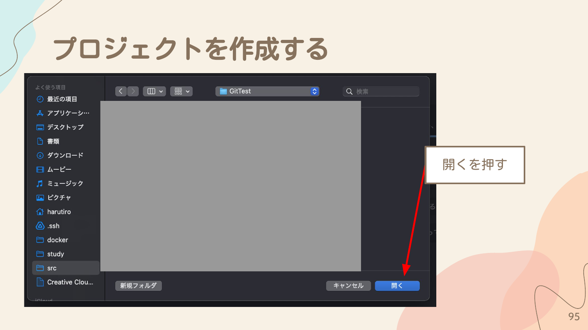

### 5. リポジトリの初期化

1. サイドバーの「ソース管理」アイコンをクリック
2. 「リポジトリを初期化する」を押す

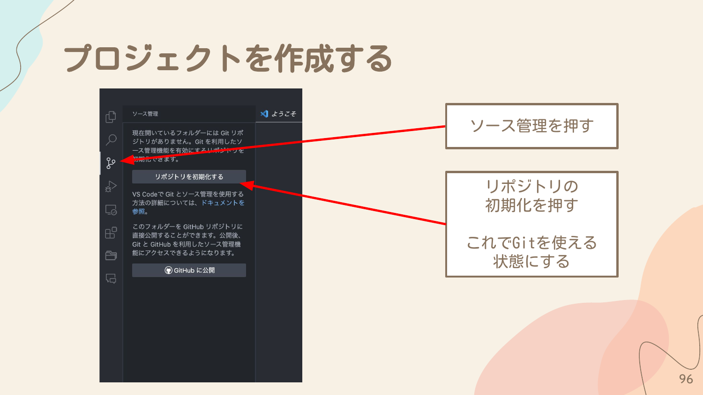

これでGitを使える状態になりました。

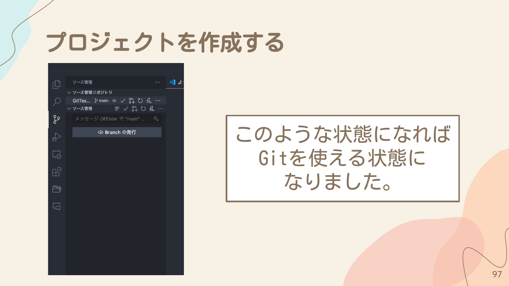

  </TabItem>
  <TabItem label="CLI">

### 1. ターミナルを起動する

**Mac の場合**: <kbd>Command</kbd> + <kbd>Space</kbd> で Spotlight を開き、「ターミナル」と入力して Enter を押します。

**Windows の場合**: <kbd>Win</kbd> + <kbd>R</kbd> で「ファイル名を指定して実行」を開き、`cmd` と入力して OK を押します。

### 2. プロジェクトフォルダを作成

```bash
# srcフォルダがある場合はその中に作成（なければスキップ）
mkdir src
cd src

# プロジェクトフォルダを作成
mkdir GitTest
cd GitTest
```

### 3. リポジトリの初期化

```bash
git init
```

以下のような出力が表示されれば成功です。

```
Initialized empty Git repository in <パス>/GitTest/.git/
```

これでGitを使える状態になりました。

  </TabItem>
</Tabs>

## ファイルを作成して、コーディングをしよう

### ワークツリーとステージとリポジトリ

Gitには3つの領域があります。

- **リポジトリ** - コミットされた変更履歴が保存される場所
- **ステージ** - コミット前の変更を一時的に置く場所
- **ワークツリー** - 実際にファイルを編集する作業場所

### ファイルの作成

<Tabs syncKey={CLI_OR_GUI_SYNC_KEY}>
  <TabItem label="VSCode">

1. エクスプローラーをクリック
2. 新規ファイル作成アイコンをクリック
3. ファイル名を入力（今回は `index.html`）してエンターを押して作成

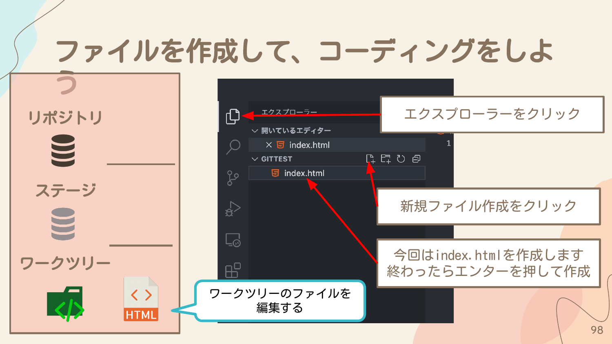

  </TabItem>
  <TabItem label="CLI">

```bash
# Macの場合
touch index.html

# Windowsの場合
type nul > index.html
```

  </TabItem>
</Tabs>

### HTMLテンプレートの入力

`index.html` ファイルで `html:5` と入力してエンターを押すと、自動でHTMLテンプレートが入力されます。

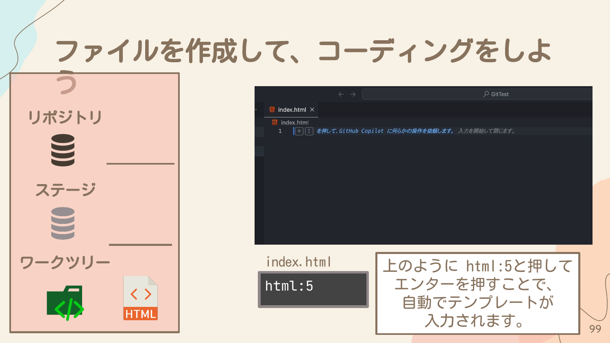

```html
<!DOCTYPE html>
<html lang="en">
<head>
    <meta charset="UTF-8">
    <meta name="viewport" content="width=device-width, initial-scale=1.0">
    <title>Document</title>
</head>
<body>

</body>
</html>
```

## Addをしてみる

<Tabs syncKey={CLI_OR_GUI_SYNC_KEY}>
  <TabItem label="VSCode">

1. サイドバーの「ソース管理」をクリック
2. 変更されたファイル（`index.html`）の横にある「+」ボタン（変更をステージ）を押してAddをする

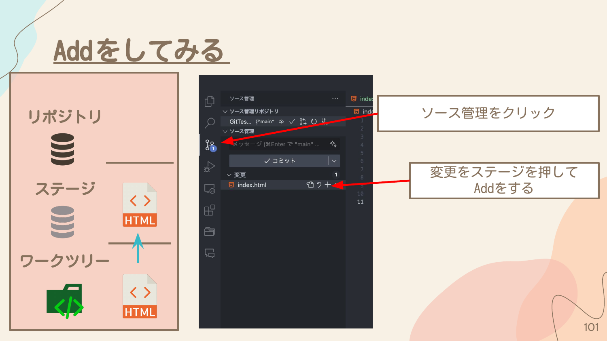

ステージされている変更にファイルが入っていればOKです。

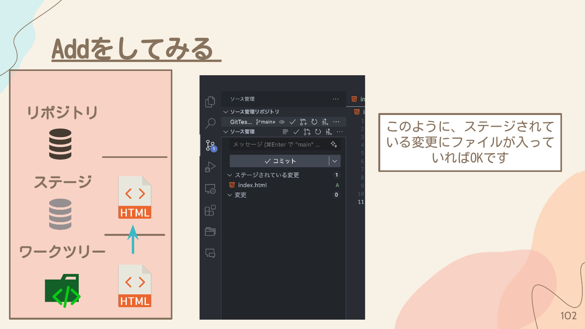

  </TabItem>
  <TabItem label="CLI">

```bash
# 特定のファイルをステージに追加
git add index.html

# すべてのファイルをステージに追加する場合
git add -A
```

ステータスを確認してみましょう。

```bash
git status
```

以下のような出力が表示されます。

```
On branch master
Changes to be committed:
  (use "git restore --staged <file>..." to unstage)
        modified:   index.html
```

ファイルがステージに追加されていることが確認できます。

  </TabItem>
</Tabs>

## コミットしてみる

<Tabs syncKey={CLI_OR_GUI_SYNC_KEY}>
  <TabItem label="VSCode">

1. コミットメッセージ（変更箇所をわかりやすくするメモ）を入力欄に書く
   - 例：「htmlのテンプレートを追加」
2. 「コミット」ボタンを押す

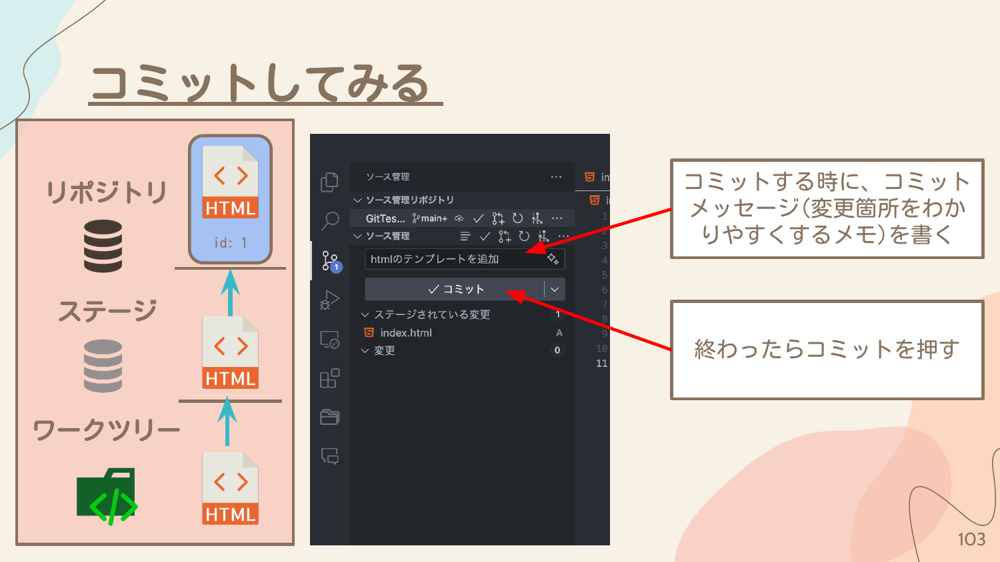

これでステージにあったファイルがリポジトリに保存されました。

  </TabItem>
  <TabItem label="CLI">

```bash
git commit -m "初めてのコミット"
```

`-m` オプションの後にコミットメッセージを入力します。

これでステージにあったファイルがリポジトリに保存されました。

  </TabItem>
</Tabs>

## コミットした履歴を見てみる

<Tabs syncKey={CLI_OR_GUI_SYNC_KEY}>
  <TabItem label="VSCode">

変更履歴を確認するために、VS Code左下の「Git Graph」を押します。

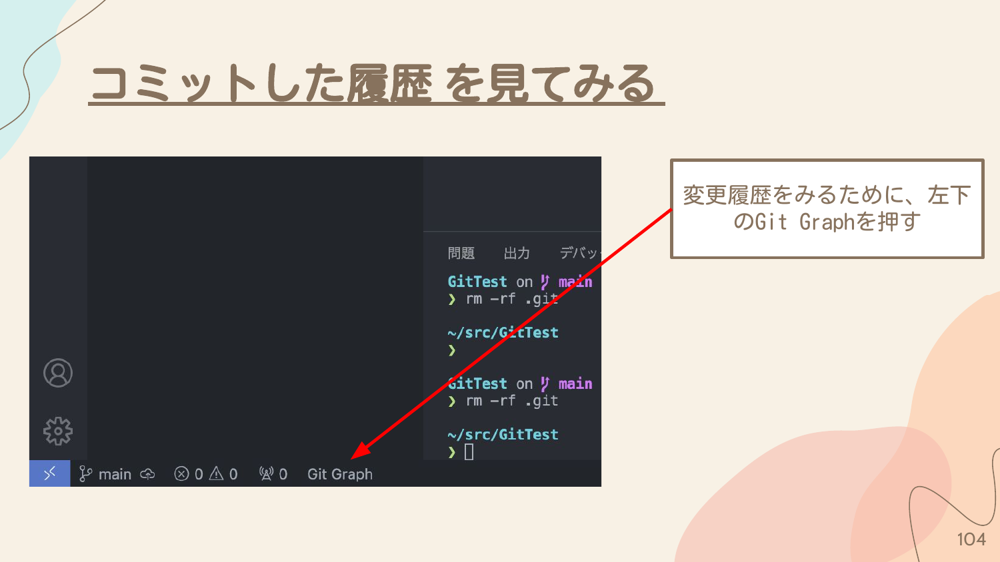

Git Graphを見ることで、Gitの現状の状態を把握することができます。

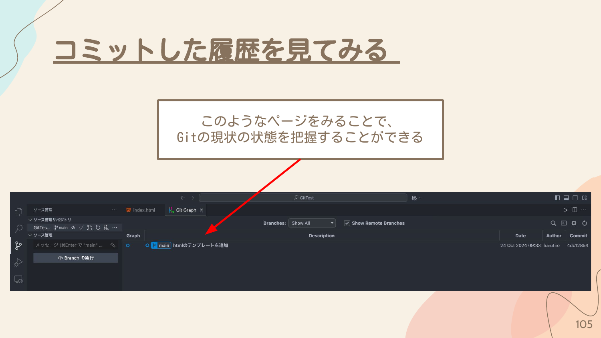

  </TabItem>
  <TabItem label="CLI">

```bash
git log
```

以下のような出力が表示されます。

```
commit 0cd513265131d7f2d915e9965d5b10ba94e80a44 (HEAD -> master)
Author: harutiro <harutiro2027@outlook.jp>
Date:   Wed Jul 13 10:48:44 2022 +0900

    初めてのコミット
```

コミットをした履歴をみることが出来ます。

  </TabItem>
</Tabs>

## GitHubでリポジトリを作成する

<Tabs syncKey={CLI_OR_GUI_SYNC_KEY}>
  <TabItem label="VSCode">

### 1. Branchの発行

1. ソース管理を開く
2. 「Branch の発行」を押す

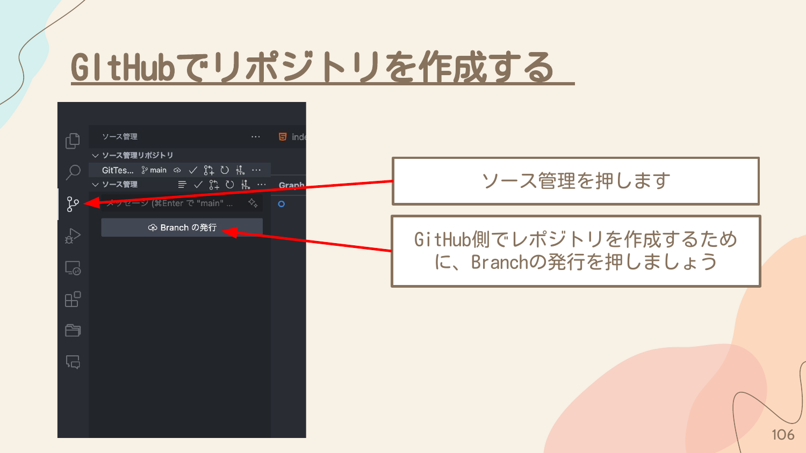

### 2. リポジトリの設定

1. GitHubでのリポジトリ名を記述します（今回は同じく `GitTest` とする）
2. PrivateとPublicを選択します
   - **Private** - 自分だけにしか公開されません
   - **Public** - 全世界に公開されます
   - 今回はPrivateにしておきましょう

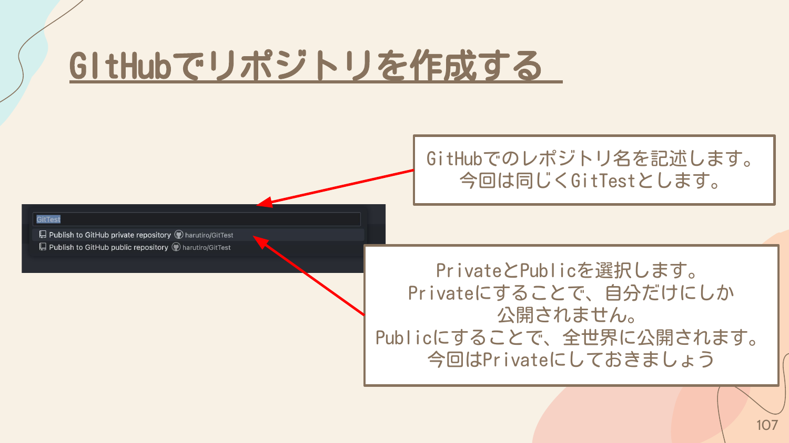

### 3. 確認

右下に「GitHub上で開く」というポップアップが表示されるので、「GitHub上で開く」を押します。

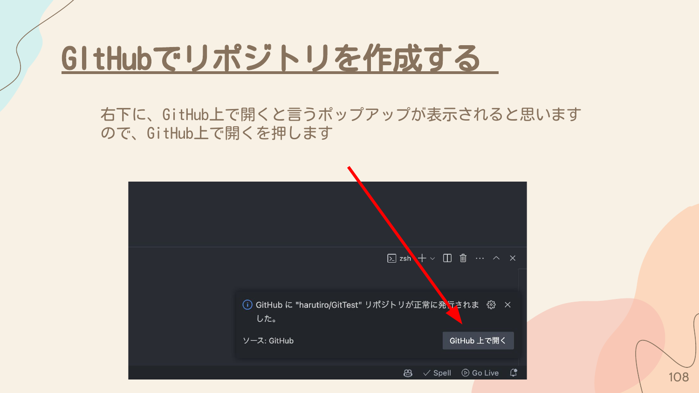

作成されているファイルが表示されていたら成功です。

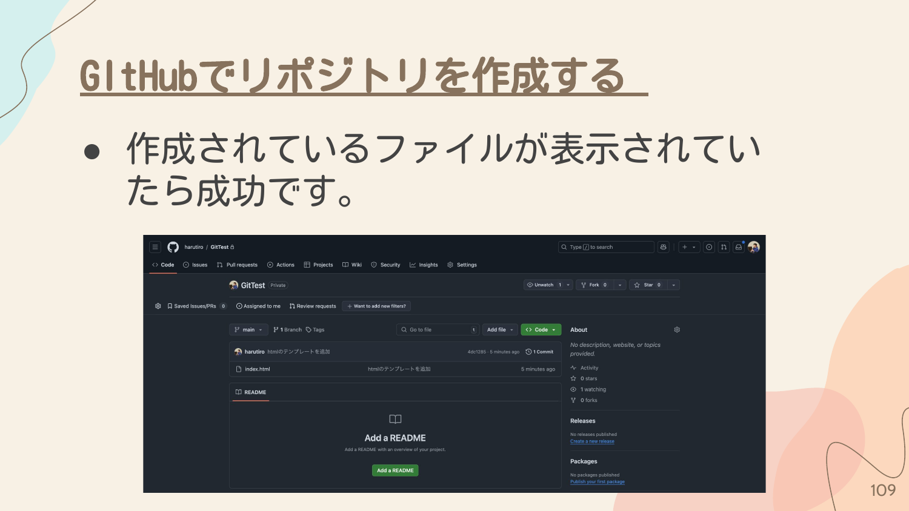

  </TabItem>
  <TabItem label="CLI">

### 1. GitHubでリポジトリを作成

1. https://github.com にアクセスする
2. 右上のアイコンをクリックして「Your profile」を選択
3. 「Repositories」タブをクリック
4. 「New」ボタンをクリック
5. リポジトリ名を入力（今回は `GitTest`）
6. Public または Private を選択
7. 「Create repository」をクリック

### 2. SSHのURLをコピー

作成されたリポジトリページで「SSH」が選択されていることを確認し、URLをコピーします。

### 3. リモートリポジトリを追加

```bash
git remote add origin <コピーしたURL>
```

例:
```bash
git remote add origin git@github.com:harutiro/GitTest.git
```

### 4. プッシュする

```bash
git push origin main
```

GitHubのリポジトリページを更新して、ファイルが表示されていたら成功です。

  </TabItem>
</Tabs>

## まとめ

Gitの基本的な流れを覚えましょう。

1. **編集** - ファイルを編集する
2. **Add** - コミットするファイルを追加する
3. **Commit** - 追加・変更点をGitに追加する
4. **Push** - リモート（ネット）に打ち上げる
5. **Pull** - リモート（ネット）から変更点をもらう

この流れを繰り返して開発を進めていきます。
